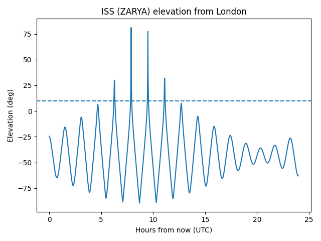

# OrbitVis – LEO Pass Predictor (Python)


A Python tool that fetches live TLE data and predicts satellite visibility passes (AOS/LOS, max elevation, duration) for a ground station (London).

## Example output



## Quickstart (Windows)

```powershell
python -m venv .venv
.\.venv\Scripts\Activate.ps1
pip install -r requirements.txt
python orbit_pass_predictor.py


(If you want, add a macOS/Linux block too.)

---

## 4) Make your repo page look good (About + topics)
On the repo page (right side “About”), click the ⚙️ gear and set:

**Description:**
`Python LEO satellite pass predictor (TLE propagation + AOS/LOS + elevation plots)`

**Topics (tags):**
`python`, `satellite`, `astrodynamics`, `tle`, `sgp4`, `skyfield`, `space`, `orbital-mechanics`

This helps people instantly “get” what it is.

---

## 5) Make the notebook display nicely
Your `.ipynb` will render on GitHub. Make it look clean by adding a top markdown cell in the notebook:

```markdown
# OrbitVis – LEO Pass Predictor

This notebook predicts satellite visibility passes (AOS/LOS, max elevation, duration) for a ground station using live TLE data and Skyfield.
